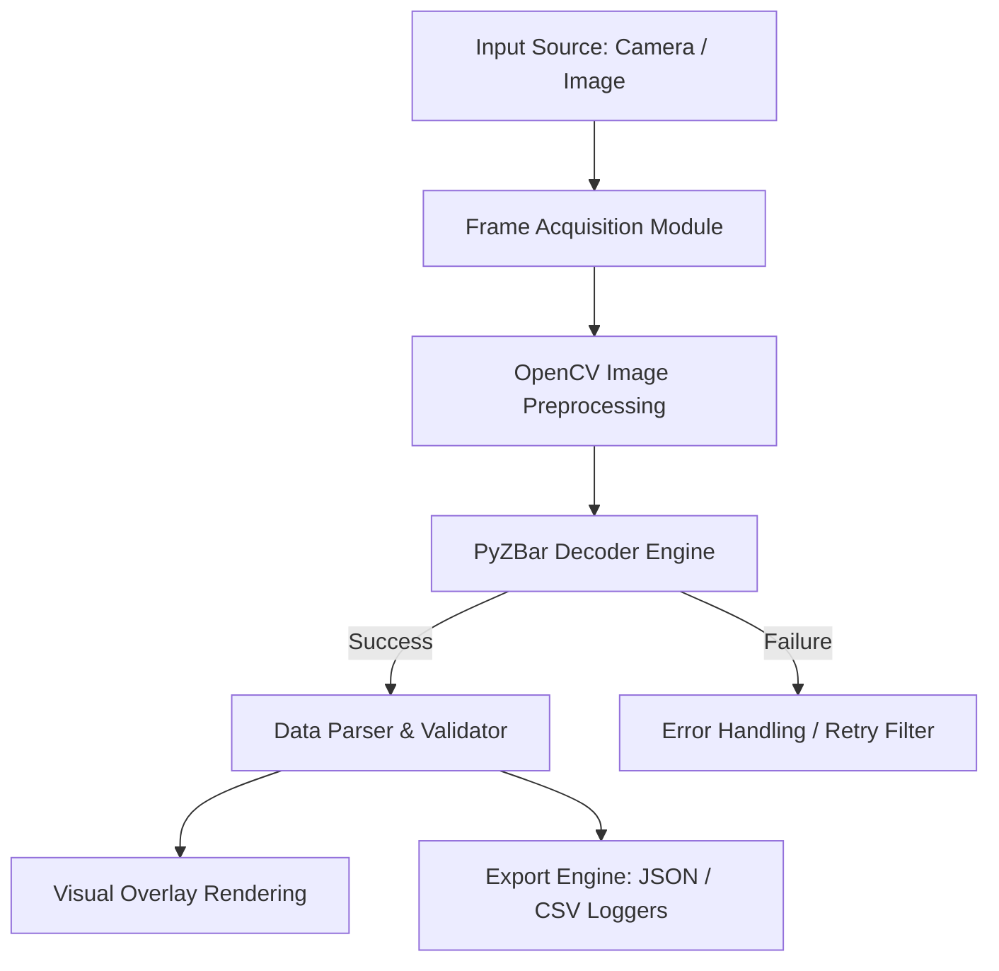

# Enterprise Barcode & QR Code Intelligence Suite

An edge-optimized computer vision engine designed for real-time decoding, processing, and structured export of 1D barcodes and 2D QR codes from dynamic video streams and static images.

---

## Key Features

* **Multi-Format Decoding:** Supports 1D barcodes (UPC-A, EAN-13, Code 128) and 2D matrix codes (QR Code, Data Matrix).
* **Dual Capture Modes:** Real-time webcam frame acquisition and bulk image processing.
* **Image Preprocessing Pipeline:** Automated contrast adjustment and noise reduction for damaged, low-resolution, or poorly lit inputs.
* **Structured Data Export:** Automatically parses decodes into ISO 8601 timestamped JSON and CSV audit logs.
* **Configurable FPS Target:** Optimized frame processing loop to run efficiently on resource-constrained devices.

---

## Tech Stack

* **Language:** Python 3.9+
* **Computer Vision:** OpenCV (`opencv-python`)
* **Decoding Engine:** PyZBar / `pyzbar`
* **Data Processing:** Pandas, NumPy
* **Formatting & Quality:** Black, Flake8

---

## System Architecture



---

## Getting Started

### Prerequisites

Ensure system-level dependencies for `zbar` are installed:

* **Linux (Ubuntu/Debian):**
  ```bash
  sudo apt-get install libzbar0
  ```
* **macOS:**
  ```bash
  brew install zbar
  ```

### Installation

1. **Clone the repository:**
   ```bash
   git clone https://github.com/your-username/barcode-qr-intelligence-suite.git
   cd barcode-qr-intelligence-suite
   ```

2. **Create and activate a virtual environment:**
   ```bash
   python -m venv venv
   source venv/bin/activate  # On Windows: venv\Scripts\activate
   ```

3. **Install dependencies:**
   ```bash
   pip install -r requirements.txt
   ```

---

## Usage

### 1. Real-Time Camera Scanner
Run the live video feed scanner via your primary webcam:
```bash
python main.py --source camera --device-id 0
```

### 2. Single Image Processing
Decode a standalone image file and print results to the terminal:
```bash
python main.py --source image --path assets/sample_qr.png
```

### 3. Batch Processing
Process an entire folder of images and log outputs to JSON:
```bash
python main.py --source batch --dir ./input_images/ --output export.json
```

---

## Supported Symbologies

| Code Type | Category | Supported Standards |
| :--- | :--- | :--- |
| **2D Matrix** | High Density Data | QR Code, Data Matrix |
| **1D Linear** | Retail & Logistics | UPC-A, EAN-13, EAN-8 |
| **1D Industrial** | Inventory Management | Code 128, Code 39, ITF |

---

## Output Format

Decoded payloads are exported with standard metadata:

```json
[
  {
    "id": "c4ca4238a0b923820dcc509a6f75849b",
    "timestamp": "2026-08-26T12:28:52Z",
    "symbology": "QRCODE",
    "payload": "https://example.com/asset/10492",
    "bounding_box": {
      "x": 120,
      "y": 85,
      "width": 200,
      "height": 200
    }
  }
]
```

---

## License

Distributed under the MIT License. See `LICENSE` for more information.
