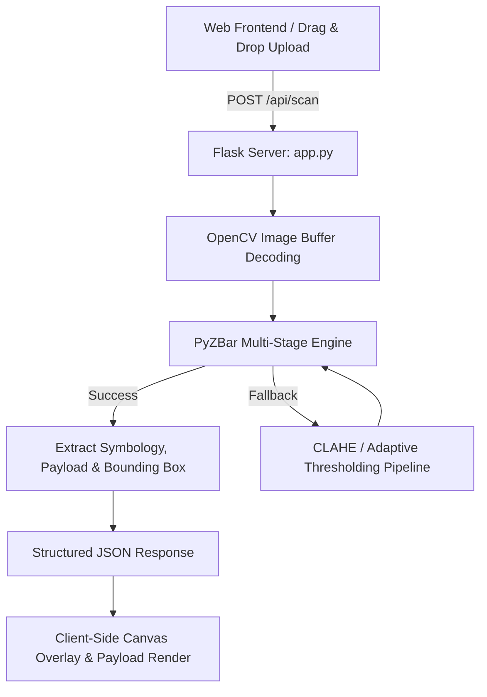

# Enterprise Barcode & QR Code Intelligence Suite (Web & Vercel Edition)

An edge-optimized computer vision engine refactored into a web-ready Flask application, deployable serverlessly on Vercel (`@vercel/python`). Capable of real-time decoding, structured JSON reporting, visual contour overlay, and processing of 1D barcodes and 2D QR codes from uploaded image buffers.

---

## Key Features

* **Web SPA Interface:** Responsive HTML5 glassmorphic UI with drag-and-drop file upload and client-side image preview.
* **Multi-Format Decoding:** Supports 1D barcodes (UPC-A, EAN-13, Code 128) and 2D matrix codes (QR Code, Data Matrix).
* **Multi-Stage Image Preprocessing Pipeline:** Automated contrast enhancement (CLAHE) and adaptive thresholding fallback for damaged or low-contrast barcodes.
* **Visual Bounding Box Canvas:** Client-side HTML Canvas overlay drawing exact polygon contours and bounding boxes over detected codes.
* **Vercel Serverless Ready:** Pre-configured with `vercel.json` (`@vercel/python`) and optimized headless dependencies (`opencv-python-headless`).
* **Structured API Output:** RESTful POST endpoint (`/api/scan`) returning ISO ISO-compliant JSON data containing symbology, decoded payload text, and coordinate bounding boxes.

---

## System Architecture



---

## File Structure

```
.
├── app.py                 # Flask server with / and /api/scan endpoints
├── templates/
│   └── index.html         # HTML5 Single Page Web Application
├── vercel.json            # Vercel deployment configuration (@vercel/python)
├── requirements.txt       # Optimized serverless Python dependencies
└── README.md              # Documentation
```

---

## Local Development

### 1. Installation

1. **Clone the repository:**
   ```bash
   git clone https://github.com/Bavya-M/barcode-qr-intelligence-suite.git
   cd barcode-qr-intelligence-suite
   ```

2. **Create and activate a virtual environment:**
   ```bash
   python -m venv venv
   # On Windows:
   venv\Scripts\activate
   # On macOS/Linux:
   source venv/bin/activate
   ```

3. **Install dependencies:**
   ```bash
   pip install -r requirements.txt
   ```

### 2. Running the Server

Start the local Flask development server:
```bash
python app.py
```
Open `http://127.0.0.1:5000` in your web browser.

---

## API Documentation

### `POST /api/scan`

Decodes barcodes from an uploaded image payload.

- **Request Type:** `multipart/form-data`
- **Body Field:** `image` or `file` (File binary)

#### Example Response (Success - 200 OK)

```json
{
  "status": "success",
  "count": 1,
  "message": "Successfully decoded 1 barcode(s).",
  "image_dimensions": {
    "width": 800,
    "height": 600
  },
  "results": [
    {
      "symbology": "QRCODE",
      "payload": "https://example.com/asset/10492",
      "bounding_box": {
        "x": 120,
        "y": 85,
        "width": 200,
        "height": 200
      },
      "polygon": [
        {"x": 120, "y": 85},
        {"x": 320, "y": 85},
        {"x": 320, "y": 285},
        {"x": 120, "y": 285}
      ]
    }
  ]
}
```

---

## Vercel Deployment

Deploy directly via Vercel CLI or GitHub integration:

```bash
npm i -g vercel
vercel --prod
```

Or connect the repository on the [Vercel Dashboard](https://vercel.com/new).

---

## License

Distributed under the MIT License. See `LICENSE` for details.
